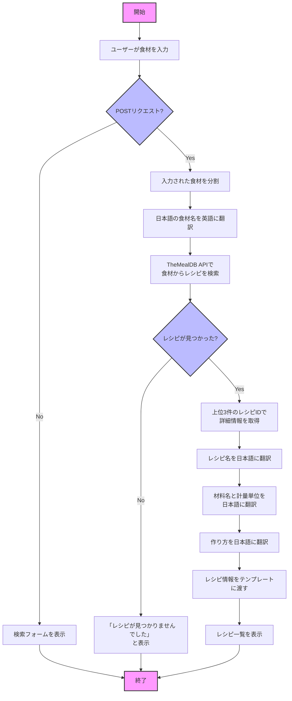

```mermaid
flowchart TD
    A[開始] --> B[ユーザーが食材を入力]
    B --> C{POSTリクエスト?}
    C -->|No| D[検索フォームを表示]
    C -->|Yes| E[入力された食材を分割]
    E --> F[日本語の食材名を英語に翻訳]
    F --> G[TheMealDB APIで\n食材からレシピを検索]
    G --> H{レシピが見つかった?}
    H -->|No| I[「レシピが見つかりませんでした」\nと表示]
    H -->|Yes| J[上位3件のレシピIDで\n詳細情報を取得]
    J --> K[レシピ名を日本語に翻訳]
    K --> L[材料名と計量単位を\n日本語に翻訳]
    L --> M[作り方を日本語に翻訳]
    M --> N[レシピ情報をテンプレートに渡す]
    N --> O[レシピ一覧を表示]
    D --> P[終了]
    I --> P
    O --> P

style A fill:#f9f,stroke:#333,stroke-width:2px
style P fill:#f9f,stroke:#333,stroke-width:2px
style C fill:#bbf,stroke:#333,stroke-width:2px
style H fill:#bbf,stroke:#333,stroke-width:2px
```
